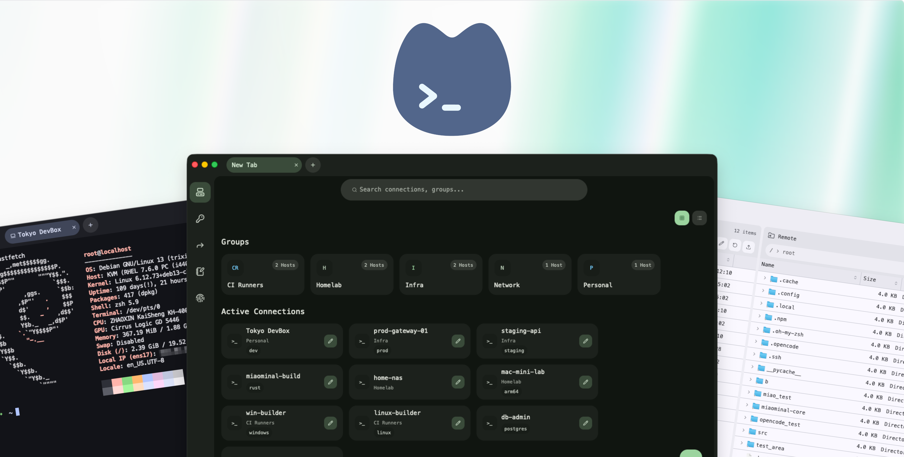
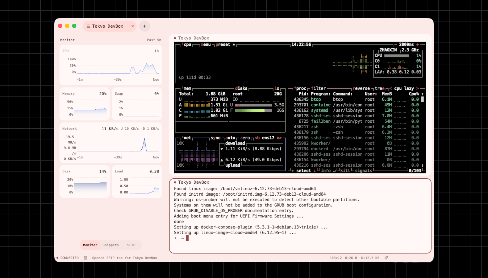
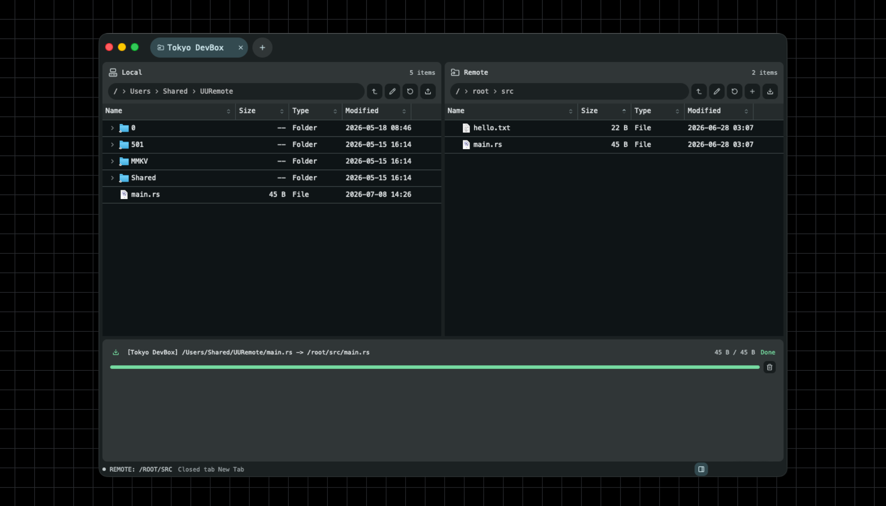
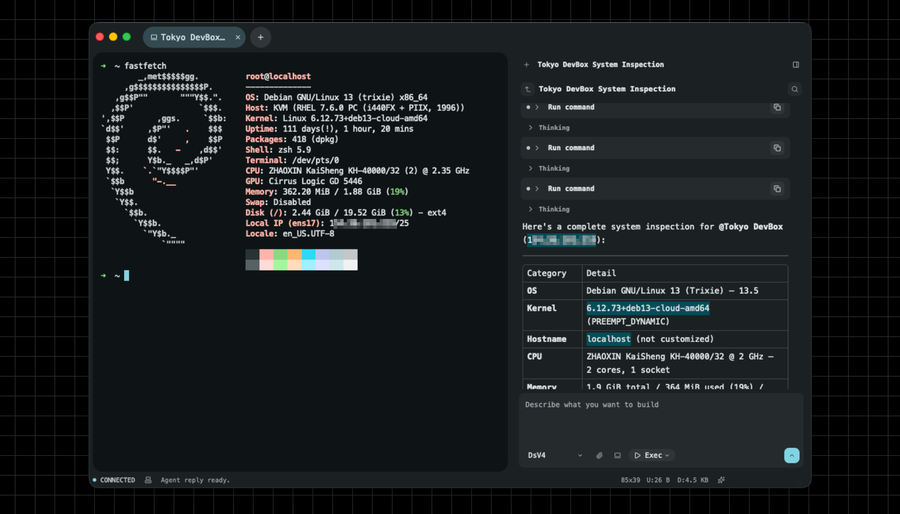
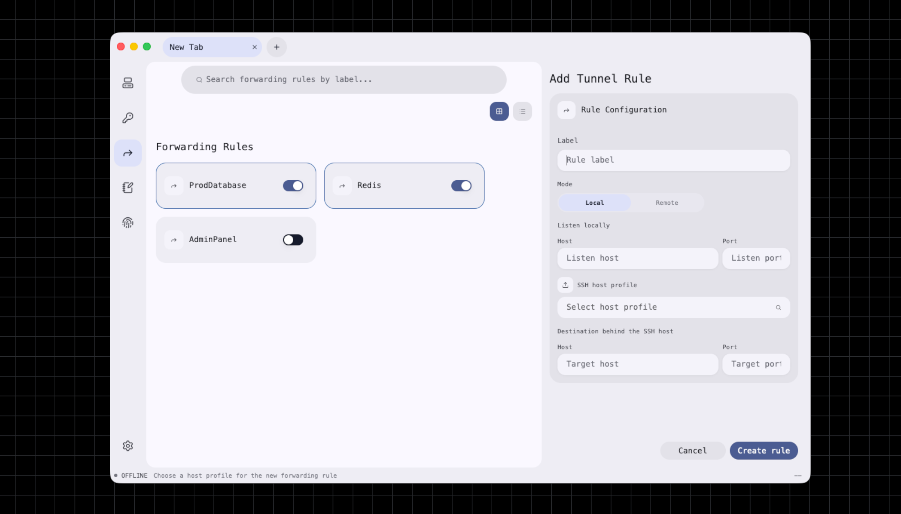

<div align="center" style="border-bottom: none">
    <h1>
        Miaominal
        <br><br>
        
    </h1>
    <a href="https://github.com/cppakko/miaominal/releases"></a>
    <a href="https://github.com/cppakko/miaominal/actions/workflows/release.yml"></a>
    <a href="https://www.rust-lang.org/"></a>
    <a href="../LICENSE"></a>
    <br>
    <p align="center">
        Miaominal 是面向远程开发和服务器运维的桌面 SSH 工作台：把终端会话、SSH 主机管理、SFTP 文件传输、端口转发、敏感凭据、加密同步和会话级 Agent 放在同一个工作区里。它使用 Rust、GPUI 和 `alacritty_terminal` 构建，目标是让高频远程操作更稳定、更集中、更容易恢复，并在设计上尽量降低内存开销。
    </p>
</div>

<p align="center"><a href="./README.md">English</a> · <a href="./README_zh.md">简体中文</a></p>

<p align="center"><a href="#功能">功能</a> · <a href="#安装">安装</a> · <a href="#核心功能截图展示">核心功能截图展示</a> · <a href="#加密同步与设置">加密同步与设置</a> · <a href="#从源码运行">从源码运行</a></p>

## 功能

- **SSH 主机管理:** 保存连接配置、认证方式、启动命令、环境变量、标签与分组。
- **配置导入:** 支持从 OpenSSH config、PuTTY `.reg`、SecureCRT `.xml` 和 FinalShell `.json` 导入 SSH 配置。
- **轻量原生栈:** 基于原生 Rust 桌面栈和终端后端构建，面向日常多会话 SSH 工作流尽量降低内存开销。
- **现代终端体验:** 基于 `alacritty_terminal`，支持标签页、pane 拆分、滚屏搜索、复制粘贴和最近关闭标签恢复。
- **SFTP 工作台:** 本地与远程文件浏览、上传下载、拖拽选择、覆盖确认、删除确认、创建文件夹、暂停 / 恢复 / 取消传输。
- **端口转发:** 管理本地转发与远程转发规则，并与已保存的 SSH 主机关联。
- **远程监控:** 在 SSH 会话就绪后采集 CPU、内存、Swap、磁盘、网络和负载指标。
- **脚本片段:** 保存可复用命令和 shell 配方，在日常会话中快速调用。
- **凭据与信任:** known hosts 管理、系统 keychain、本地 vault、托管私钥和 SSH agent 身份。
- **加密同步:** 通过 GitHub Gist 或 WebDAV 同步配置，敏感字段使用 Argon2id 派生密钥与 AES-256-GCM 加密后上传。
- **Session Agent:** 聊天历史、标题生成、附件、Markdown 渲染、工具调用状态、后台 job、审批模式和中断恢复。

<div align="center">
    
</div>

## 安装

### Windows

1. 从 [Releases](https://github.com/cppakko/miaominal/releases/latest) 下载 `Miaominal-windows-x64-setup.exe`。
2. 运行安装包并按提示安装。
   - 也可以下载 `Miaominal-windows-x64-standalone.exe` 直接启动。

### macOS

1. 从 [Releases](https://github.com/cppakko/miaominal/releases/latest) 下载 `Miaominal-macos-arm64.dmg`。
2. 打开 `.dmg`，把 `Miaominal.app` 拖入 `Applications`。
3. 如果系统拦截未签名应用，请尝试运行

~~~ bash
spctl --global-disable
xattr -dr com.apple.quarantine /Applications/Miaominal.app
~~~

### Linux

1. 从 [Releases](https://github.com/cppakko/miaominal/releases/latest) 下载 `Miaominal-linux-x86_64.AppImage`。
2. 授予执行权限并运行：

```bash
chmod +x Miaominal-linux-x86_64.AppImage
./Miaominal-linux-x86_64.AppImage
```

## 核心功能截图展示

### 主机与终端会话

集中管理 SSH 主机、最近连接、标签、分组和认证方式，并在工作区中打开终端标签页或拆分 pane。

<p align="center">
    
    <br>
</p>

### SFTP 文件传输

在终端侧边面板中使用本地 / 远端双栏文件浏览器，处理上传下载、目录创建、覆盖确认、删除确认和传输进度。

<p align="center">
    
    <br>
</p>

### Session Agent

在当前会话旁边打开 Agent 面板，使用可配置 provider 进行问答、读取文件、执行命令、应用补丁、联网搜索或获取网页内容。工具调用会经过审批模式控制。

| 能力范围 | 说明 |
| --- | --- |
| 当前会话 | 读取工作区信息，理解当前终端上下文，并把短命令或长时间任务交给对应 shell 执行。 |
| SSH 主机 | 通过 `@` 提及已打开或已保存的主机，把读取文件、搜索、命令执行和补丁应用定位到指定远端。 |
| 工作区文件 | 使用 `read`、`list`、`glob`、`grep` 检查文件，并通过 `apply_patch` 创建、修改或删除文件。 |
| 后台任务 | 对服务器、日志、测试、部署等长任务使用后台 job，并在会话里继续查看状态、停止任务或接续结果。 |
| 联网检索 | 使用配置好的 Web Search / Fetch 获取网页信息，再和终端、文件、附件上下文一起分析。 |

| 执行模式 | 适合场景 | 工具与审批差别 |
| --- | --- | --- |
| **ASK** | 只想让 Agent 帮忙理解项目、检索文件或回答问题。 | 仅开放只读工具、`web_search` / `web_fetch` 和向用户提问，不执行命令或修改文件。 |
| **执行** | 日常开发与运维的默认模式。 | 开放全部工具；网页搜索 / 抓取可直接运行，文件修改、非只读 shell 命令和高风险操作会经过审批或风险策略检查。 |
| **非阻断** | 想让 Agent 先规划并列出要做的操作，再逐项确认。 | 开放全部工具，但除向用户提问外，工具调用会暂停在审批状态，批准后才继续执行。 |
| **全自动** | 明确授权 Agent 连续完成任务。 | 开放全部工具并自动执行；仍保留基础路径规范化、执行超时和输出限制。 |

<p align="center">
    
    <br>
</p>

### 端口转发

为已保存主机创建本地或远程转发规则，快速连接、断开、复制、编辑或打开浏览器访问转发目标。

<p align="center">
    
    <br>
</p>

### 加密同步与设置

Miaominal 的同步设计把“本地保存”和“云端备份”分开处理：普通配置可以同步，敏感凭据默认留在本机的安全存储中；当需要跨设备同步敏感数据时，会先用你的同步口令加密，再上传到远端。

- **本地安全存储:** API key、SSH 密码、同步凭据和托管私钥默认写入系统 keyring。启用本地 vault 后，这些 secrets 会迁移到当前设备上的本地加密 vault，解锁需要本地 vault 口令。
- **本地 vault:** vault 使用独立于同步口令的本机密码保护，可手动解锁、锁定，并支持自动锁定时间。它适合保护你希望只保存在当前设备上的敏感数据。
- **云同步后端:** 支持 GitHub Gist 和 WebDAV，可同步 SSH profiles、脚本片段、托管密钥、快捷键、连接偏好、Agent provider / Web Search 元数据等非外观类配置。
- **端到端加密:** 密码、SSH 私钥、AI provider API key 和 Web Search API key 在参与同步时，会先使用同步口令派生密钥加密。同步口令通过 Argon2id 派生密钥，密文使用 AES-256-GCM 保护。
- **多设备恢复:** 新设备绑定同一个 Gist ID 或 WebDAV 文件后，可以 pull 远端配置；输入相同同步口令后，才能解密并使用同步过来的敏感字段。
- **不会明文上传:** GitHub token 和 WebDAV 密码只保存在本地 secret store；AI provider / Web Search API key 如参与同步，会进入加密 secrets payload，不作为明文配置写入同步文件。

## 从源码运行

### macOS 示例

```bash
brew install cmake
xcodebuild -downloadComponent MetalToolchain
cargo build --release
```

### Linux 示例

Ubuntu 24.04 示例：

```bash
sudo apt-get update
sudo apt-get install -y \
  build-essential clang cmake curl git pkg-config \
  libasound2-dev libdbus-1-dev libfontconfig-dev libglib2.0-dev \
  libgit2-dev libsecret-1-dev libsqlite3-dev libssl-dev libva-dev \
  libvulkan1 libwayland-dev libx11-xcb-dev libxkbcommon-x11-dev \
  libzstd-dev
cargo build --release
```

### Windows 示例

```powershell
winget install -e --id Kitware.CMake
choco install nasm --yes --no-progress
cargo build --release
```
