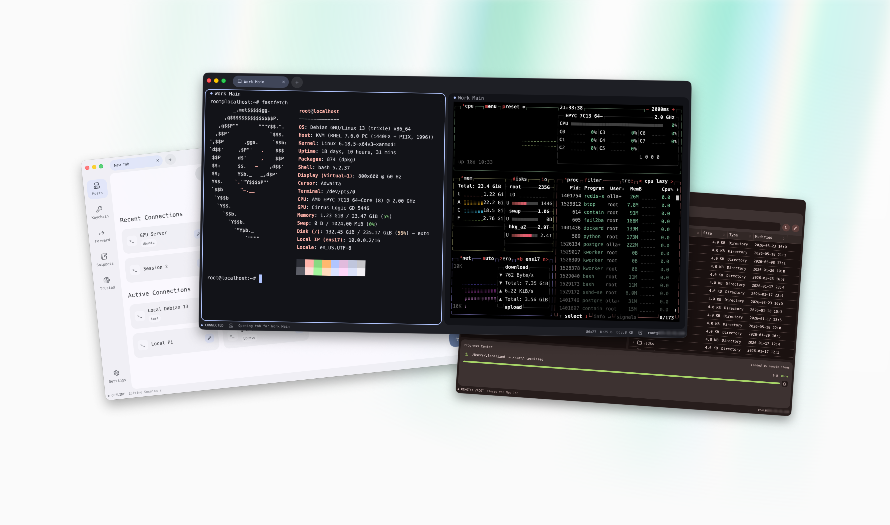
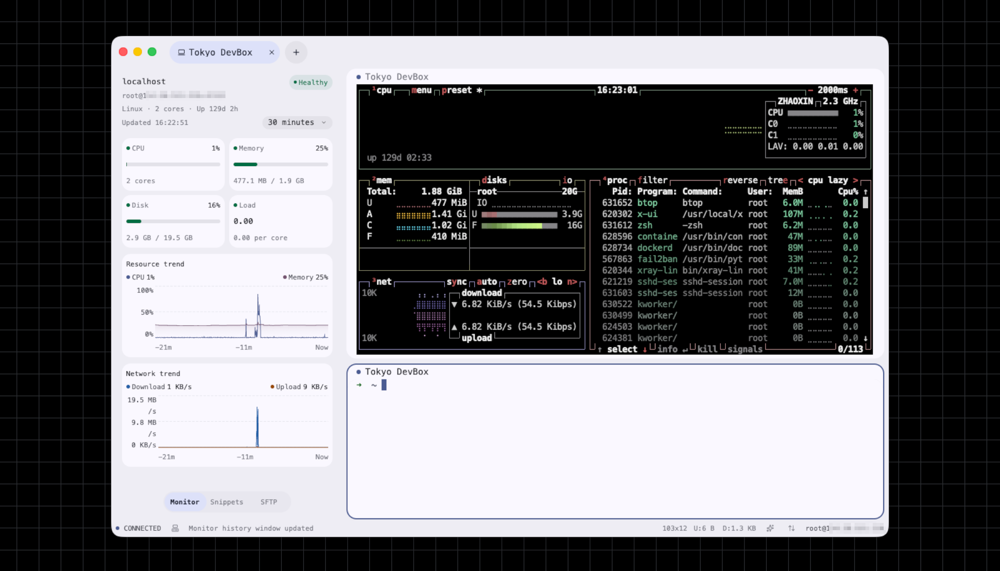
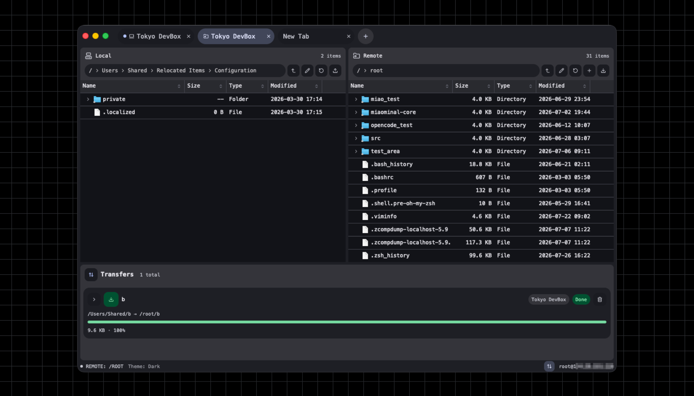
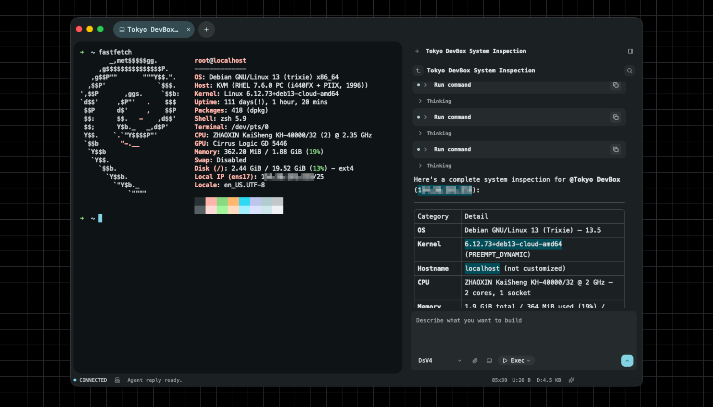
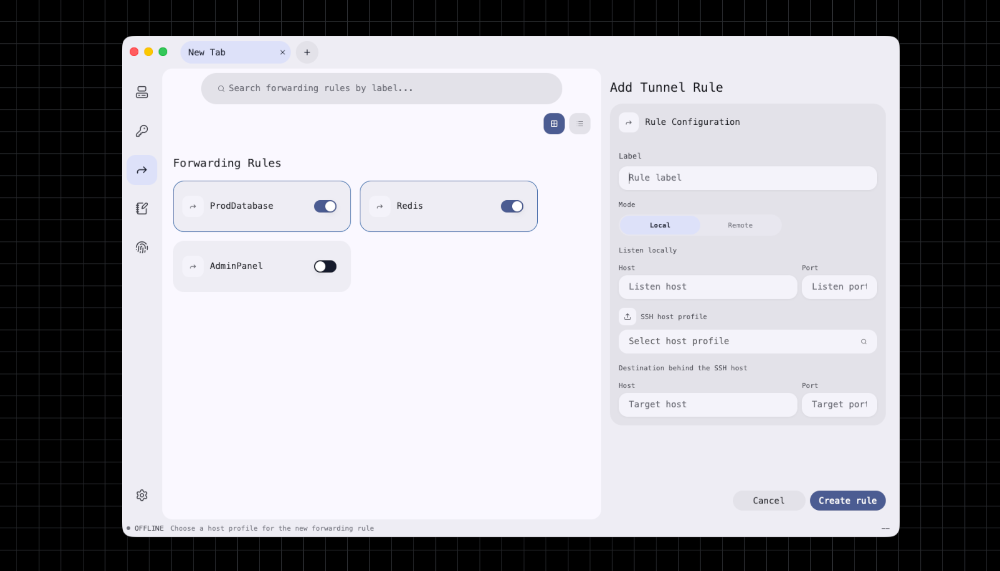

<div align="center" style="border-bottom: none">
    <h1>
        Miaominal
        <br><br>
        
    </h1>
    <a href="https://github.com/cppakko/miaominal/releases"></a>
    <a href="https://github.com/cppakko/miaominal/actions/workflows/release.yml"></a>
    <a href="https://www.rust-lang.org/"></a>
    <a href="../LICENSE"></a>
    <br>
    <p align="center">
        Miaominal 是面向远程开发和服务器运维的桌面 SSH 工作台。在一个工作区中管理主机、终端会话、SFTP 文件传输、端口转发和会话级 Agent，并通过 OpenSSH 集成把已保存的主机连接提供给外部客户端。使用 Rust、GPUI Kit 和 <code>alacritty_terminal</code> 构建。
    </p>
</div>

<p align="center"><a href="./README.md">English</a> · <a href="./README_zh.md">简体中文</a></p>

<p align="center"><a href="#功能">功能</a> · <a href="#安装">安装</a> · <a href="#核心工作流">核心工作流</a> · <a href="#凭据与同步">凭据与同步</a> · <a href="#数据目录与便携模式">便携模式</a> · <a href="#从源码构建">从源码构建</a></p>

## 功能

- **SSH 主机管理:** 保存连接配置、认证方式、启动命令、环境变量、标签与分组，并支持可复用的 SOCKS5 / HTTP CONNECT 入口代理。
- **配置导入:** 支持从 OpenSSH config、PuTTY `.reg`、SecureCRT `.xml` 和 FinalShell `.json` 导入 SSH 配置。
- **终端工作区:** 支持标签页、分屏、滚屏搜索、复制粘贴、最近关闭标签恢复、独立窗口和自由输入模式。
- **SFTP 工作台:** 本地与远程文件浏览、上传下载、拖拽选择、远程路径收藏、覆盖确认、删除确认、创建文件夹、暂停 / 恢复 / 取消传输。
- **端口转发:** 管理本地转发与远程转发规则，并与已保存的 SSH 主机关联。
- **远程监控:** 在 SSH 会话就绪后采集 CPU、内存、Swap、磁盘、网络和负载指标。
- **命令片段:** 保存可复用命令和 shell 脚本，在日常会话中快速调用。
- **凭据与信任:** 管理已知主机、系统凭据存储、本地保险库（Vault）、托管私钥和 SSH agent 身份。
- **OpenSSH 集成:** 为已保存主机生成 OpenSSH 配置；Direct 模式导出普通配置，Bridge 模式由 Miaominal 代为建立连接，并提供安全审批与审计。
- **加密同步:** 通过 GitHub Gist 或 WebDAV 手动或自动同步配置，敏感字段使用 Argon2id 派生密钥与 AES-256-GCM 加密后上传，并在冲突时提供通知和处理入口。
- **数据目录与便携模式:** 支持自定义数据目录、数据迁移和 Portable 发行包；便携模式使用本地保险库保存凭据。
- **桌面体验:** 支持系统托盘、可配置的窗口关闭行为、单实例唤醒、通知中心，以及界面与终端的字体和字号独立设置。
- **Session Agent:** 支持聊天历史、标题生成、附件、Markdown 渲染、工具调用状态、后台任务、审批模式和中断恢复。

<div align="center">
    
</div>

## 安装

从 [Releases](https://github.com/cppakko/miaominal/releases/latest) 选择对应系统和处理器架构的发行包。文件名中的 `<版本>` 是版本号（例如 `0.2.3`），请以下载页面的完整文件名为准。

| 平台 | 安装包 | 说明 |
| --- | --- | --- |
| macOS arm64 | `Miaominal-macos-arm64-<版本>.dmg` | 拖入 Applications 安装 |
| Windows x64 / arm64 | `Miaominal-windows-<架构>-<版本>-setup.exe` | 安装版；另有 `standalone.exe` 免安装运行 |
| Linux x86_64 / arm64 | `AppImage`、`.deb`、`.rpm` | 按发行版选择 |
| 三个平台 | `*-<版本>-portable.zip` | 解压后直接运行，数据保存在包内 `data` 目录 |

### macOS

1. 下载 `Miaominal-macos-arm64-<版本>.dmg`。
2. 打开 `.dmg`，把 `Miaominal.app` 拖入 `Applications`。

> [!WARNING]
> Miaominal 未经过公证签名。如果 macOS 阻止启动，请移除隔离属性：
> ~~~ bash
> xattr -dr com.apple.quarantine /Applications/Miaominal.app
> ~~~

### Windows

1. 下载对应架构、以 `-setup.exe` 结尾的安装包。
2. 运行安装包并按提示安装。

以 `-standalone.exe` 结尾的文件可以免安装启动，默认仍使用常规数据目录；需要随程序携带数据时请选择 `-portable.zip`。

### Linux

1. 下载对应架构的 `.AppImage`，或使用发行版的包管理器安装 `.deb` / `.rpm`。
2. 使用 AppImage 时，授予执行权限并运行。以下以 x86_64 的 `0.2.3` 版本为例，请替换为实际下载的文件名：

```bash
chmod +x Miaominal-linux-x86_64-0.2.3.AppImage
./Miaominal-linux-x86_64-0.2.3.AppImage
```

## 核心工作流

### 主机与终端会话

集中管理 SSH 主机、最近连接、标签、分组和认证方式，并在工作区中打开终端标签页、拆分窗格或把标签页移入独立窗口。多个主机可以复用同一份 SOCKS5 / HTTP CONNECT 入口代理配置。

在设置中启用“自由输入模式”后，可以点击移动终端光标、选择可编辑文本，并在当前或其他终端分屏之间拖动移动文本；按住 Ctrl/Cmd 拖动可复制文本。终端程序启用鼠标上报时，按住 Alt 可临时使用自由输入；Shift 使用传统选择，Shift+Alt 使用块选择。

界面与终端的字体、字号可以分别设置。关闭主窗口时可以选择退出应用或最小化到系统托盘；使用同一数据目录再次启动时，会唤醒已有实例。

通知中心集中保留操作通知历史，并为同步冲突等需要处理的事项提供设置入口。

<p align="center">
    
    <br>
</p>

### SFTP 文件传输

在终端侧边面板中使用本地 / 远端双栏文件浏览器，处理上传下载、目录创建、远程路径收藏、覆盖确认、删除确认和传输进度。收藏的远程路径可以随配置同步。

<p align="center">
    
    <br>
</p>

### Session Agent

在当前会话旁边打开 Agent 面板，配置模型服务后即可进行问答、读取文件、执行命令、应用补丁、联网搜索或获取网页内容。工具的可用范围和审批行为由所选模式决定。

| 能力范围 | 说明 |
| --- | --- |
| 当前会话 | 读取工作区信息，理解当前终端上下文，并把短命令或长时间任务交给对应 shell 执行。 |
| SSH 主机 | 通过 `@` 提及已打开或已保存的主机，把读取文件、搜索、命令执行和补丁应用定位到指定远端。 |
| 工作区文件 | 使用 `read`、`list`、`glob`、`grep` 检查文件，并通过 `apply_patch` 创建、修改或删除文件。 |
| 后台任务 | 将服务器、日志、测试、部署等长任务放到后台运行，并在会话里继续查看状态、停止任务或收集结果。 |
| 联网检索 | 使用配置好的 Web Search / Fetch 获取网页信息，再和终端、文件、附件上下文一起分析。 |

| 执行模式 | 适合场景 | 工具与审批差别 |
| --- | --- | --- |
| **Ask** | 只想让 Agent 帮忙理解项目、检索文件或回答问题。 | 仅开放只读工具、`web_search` / `web_fetch` 和向用户提问，不执行命令或修改文件。 |
| **执行** | 日常开发与运维的默认模式。 | 开放全部工具；网页搜索 / 抓取可直接运行，文件修改、非只读 shell 命令和高风险操作会经过审批或风险策略检查。 |
| **非阻塞** | 希望逐项审批 Agent 的工具调用。 | 开放全部工具，跳过策略审查，工具调用执行前等待批准；路径规范化始终执行。 |
| **全自动** | 明确授权 Agent 连续完成任务。 | 开放全部工具，完全跳过策略审查，工具调用自动执行。仅 `..` 和 `~` 路径规范化始终强制。 |

<p align="center">
    
    <br>
</p>

### 端口转发与监控

为已保存主机创建本地或远程转发规则，快速连接、断开、复制、编辑或打开浏览器访问转发目标。转发失败时可通过通知中心查看错误。

SSH 会话就绪后，监控面板可显示远端 CPU、内存、Swap、磁盘、网络和负载指标。

<p align="center">
    
    <br>
</p>

### OpenSSH 集成

在“设置 → OpenSSH 集成”中选择模式，让外部 OpenSSH 客户端使用 Miaominal 中保存的主机：

| 模式 | 连接方式 | 使用条件 |
| --- | --- | --- |
| Direct | 导出普通 OpenSSH 主机配置，由外部客户端连接远端 | 无法直接使用 Miaominal 保存的密码和专用路由 |
| Bridge | 由 Miaominal 建立远端连接，可使用已保存凭据和入口代理 | Miaominal 必须保持运行，所需凭据必须可用 |

设置页会显示生成的配置文件路径。找到文件中的 `Host` 别名后，即可在外部终端连接。例如，配置中出现 `Host miaominal-production` 时：

```bash
ssh miaominal-production
```

Bridge 不会把密码或私钥导出到生成的配置。可以配置标准连接、每次连接需批准，或在支持的平台上要求系统认证；需要授权或解锁保险库时，应用会显示请求提示。OpenSSH 设置页提供安全策略和待授权请求入口，连接活动记录在审计日志中。

## 凭据与同步

Miaominal 将本地凭据存储与云端同步分开管理。普通配置可以同步，参与同步的敏感凭据会先使用同步口令加密，再上传到远端。

- **本地安全存储:** 常规模式下，API 密钥、SSH 密码、同步凭据和托管私钥默认写入系统凭据存储（keyring）。启用本地保险库后，凭据会迁移到本地加密保险库。
- **本地保险库:** 使用独立于同步口令的密码保护，支持手动解锁、锁定和自动锁定时间。
- **同步范围:** 支持 GitHub Gist 和 WebDAV，可同步 SSH 主机配置、入口代理、命令片段、托管密钥、远程路径收藏、快捷键、连接偏好、模型服务与联网检索配置等。界面外观和端口转发的启用状态等设备本地选项不参与同步。
- **敏感数据加密:** 参与同步的密码、SSH 私钥、模型服务和联网检索 API 密钥通过 Argon2id 派生密钥与 AES-256-GCM 加密，不作为明文配置上传。GitHub token 和 WebDAV 密码仅保存在本地凭据存储中。
- **多设备恢复:** 新设备绑定同一个 Gist ID 或 WebDAV 文件后，可以拉取远端配置；输入相同同步口令后，才能解密并使用同步过来的敏感字段。
- **自动同步:** 默认关闭，需先配置同步提供方和加密口令。开启后，本地配置变更会在短暂等待后自动推送，并定期检查远端更新；本地没有未同步修改时可自动拉取。遇到冲突或缺少同步基线时会停止自动操作，通过通知中心引导手动处理；本地保险库锁定期间暂停自动同步。
- **托管密钥:** 支持在本地安全存储中管理私钥（包括 RSA-4096），并按需用于主机连接或 OpenSSH Bridge。

## 数据目录与便携模式

常规模式下，可以在设置中选择自定义数据目录并迁移现有数据。

使用 Portable 发行包时，解压后保持程序、`portable.flag` 和 `data` 目录在一起运行；macOS 的标记文件和数据目录位于 `.app` 包旁。也可以通过 `--portable` 启动参数启用便携模式。此模式固定使用便携目录中的 `data`，并要求使用本地保险库保存敏感凭据，不使用系统 keyring。

本地保险库口令和云同步口令相互独立。迁移便携目录到另一台设备后，仍需使用原本的保险库口令解锁凭据。

## 从源码构建

先安装 Rust 工具链并获取仓库源码，然后在仓库根目录执行以下命令。

### macOS 示例

```bash
brew install cmake
xcodebuild -downloadComponent MetalToolchain
cargo build --release
```

### Linux 示例

Ubuntu 24.04 示例：

```bash
sudo apt-get update
sudo apt-get install -y \
  build-essential clang cmake curl git pkg-config \
  libasound2-dev libdbus-1-dev libfontconfig-dev libglib2.0-dev \
  libgtk-3-dev libayatana-appindicator3-dev \
  libgit2-dev libsecret-1-dev libsqlite3-dev libssl-dev libva-dev \
  libvulkan1 libwayland-dev libx11-xcb-dev libxkbcommon-x11-dev \
  libzstd-dev
cargo build --release
```

### Windows 示例

```powershell
winget install -e --id Kitware.CMake
choco install nasm --yes --no-progress
cargo build --release
```
